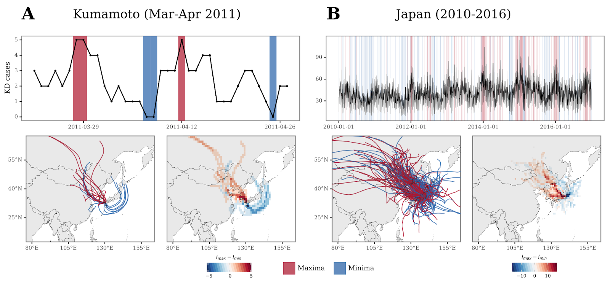

# Sub-weekly signatures relate ultrafine aerosols enriched in metals from intensive farming and urban pollution to Kawasaki disease

[](https://alfontal.github.io/kd-metals-swc)


[](https://zenodo.org/badge/latestdoi/498811401)


This repository contains the materials and code necessary to reproduce the analysis on the manuscript 
_Sub-weekly signatures relate ultrafine aerosols enriched in metals from intensive farming and urban pollution to Kawasaki disease_.

**To check the code notebooks, please follow [this link](https://alfontal.github.io/kd-metals-swc)**.

The public data (which relates to LIDAR, meteorology and chemical characterization of the air) can
be found in the `data` folder of this repo.

Data pertaining to the Kawasaki Disease cases is not publicly available as it contains sensitive information, but can be made available for research through resaonable request to the data
owner, Prof. Nakamura (nakamuyk@jichi.ac.jp).


## Reproducibility

The main requirements to execute the code will be to have installed in your computing environment:

+ Python >=3.8
+ R >= 4.1.2
+ HYSPLIT 5.2.0

Instructions to reproduce the environment follow:

### Python

To ensure reproducibility of the Python environment, we use `poetry`, so the dependencies of the project are defined in the `pyproject.toml` file. Go to the `poetry` [docs](https://python-poetry.org/docs/) to find out how to install it in your machine in case it's not there already. 

Then, clone this repo, go to the root folder, and run `poetry install`. 


### R

The R code used in the analyses was executed using R version 4.1.2, and the list of dependencies is the following, so make sure to have them installed in your environment:

```
ggplot2
dplyr
tidyr
readr
stringr
tibble
reprex
lubridate
caTools
TeachingDemos
reshape2
caret
ggpubr
purr
plot3D
Hmisc
progress

```

### HYSPLIT

To estimate the backtrajectories of air sources, in this study we use [HYSPLIT 5.2](https://www.ready.noaa.gov/HYSPLIT.php). You will need a local installation of the last version of HYSPLIT in order to be able to run the model yourself. Check the documentation on the provided link to be able to perform the installation on your local machine, as it changes depending on your OS. 

#### Meteorology data

You will also need to download the associated gridded meteorology data in order to be able tu run HYSPLIT. In this case, the data used is GDAS 1x1 data, from 2011 to 2016. This is not included in the repository as it contains several GB of information. This data is available for download via the NOAA's archives FTP, accessible through this link: https://www.ready.noaa.gov/archives.php.


## Code

We have shared three different notebooks to disclose how different parts of the analyses in the manuscript are made:

### 1. HYSPLIT trajectories

This notebook can be accessed [**here**](https://alfontal.github.io/kd-metals-swc/hysplit_trajectories.html).

Here you can check how the backtrajectories shown in **Figure 3** and **Supplementary Figure 2** traced with HYSPLIT are generated.


<figcaption align = "center"><b>Figure 3</b> </figcaption>

### 2. Metal-rich aerosols and KD in Kumamoto

This notebook can be accessed [**here**](https://alfontal.github.io/kd-metals-swc/metals.html).

Here, you can check the analysis that relates the presence of metal-rich aeorosols and KD in Kumamoto.


<figcaption align = "center"><b>Figure 2</b> </figcaption>


### 3. Kawasaki Disease's sub-weekly cycle figures.

This notebook can be accessed [**here**](https://alfontal.github.io/kd-metals-swc/weekly-cycle-figures-ang.html).

Analysis and figures related to the LIDAR profiles and subweekly cycle of Kawasaki Disease.


<figcaption align = "center"><b>Figure 6</b> </figcaption>

### 4. Historical computation of northwesterly winds.

This notebook can be accessed [**here**](https://alfontal.github.io/kd-metals-swc/winds.html).

As part of the peer-review process, the historical North-westerly winds arriving to different locations in Japan were computed.


